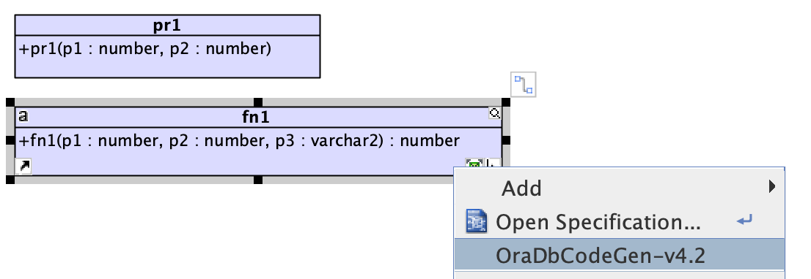
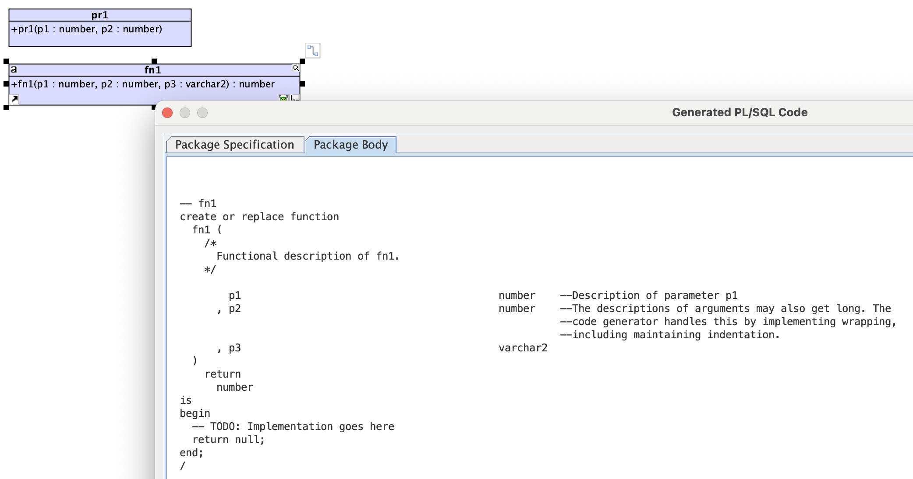

# Managing complex APIs with UML and generating scaffold code from them

This repo demonstrates:

1. **Modeling PL/SQL with UML classes**, from which **specifications** can be generated, and from which **scafolding-code** can be generated, and the perfect transfer of documentation (descriptions) from the model to the code.

1. Examples of **advanced (and well formed) Oracle PL/SQL** database packages.

1. A visual-paradigm **extension** from which **PL/SQL code is generated** from UML class diagrams.

## Modeling PL/SQL with UML classes

This repo contains the **html generated from a UML model**.  Github only shows html sources, and does not render the html, so it is best viewed here:

<a  href="https://raw.githack.com/sco2012/model-plsql-code-with-uml/main/html/index.html" target="_BLANK">
   link1
</a>
or
<a  href="https://rawcdn.githack.com/sco2012/model-plsql-code-with-uml/9b1ecd5a07eb2f1fbb60b646443db55570ea7deb/html/index.html" target="_blank">
   link2
</a>

## Advanced PL/SQL code

The **PL/SQL code `xxschema."xxpub2"`** (see [spec](plsql/Modeling-PLSQL-code-using-UML-classes/Returning-ref-cursors/xxschema.xxpub2.pks.sql) and [body](plsql/Modeling-PLSQL-code-using-UML-classes/Returning-ref-cursors/xxschema.xxpub2.pkb.sql)) illustrates:

- Well documented code, including samples of how to use each of the functions within the package specification.
- The use of pipeline functions (see `fn4`).
- The use of record types.
- Modularisation: `fn4RefC` returns a refcursor, and `fn4` takes a refcursor as its input.  A Java client (eg. an app) can handle weekly-typed data, such as from `fn4Rec`, but SQL client (eg. a separate database package) requires a strongly-typed return type, which is what `fn4` provides, whilst reusing the SQL imbebbed within `fn4Rec`.  Thus, the underlying query does not have to be implemented in two separate pieces of code.

## Visual-paradigm extension to generate PL/SQL

visual-paradigm is a commercial UML tool, coded with Java.  It provides for Java extensions to be coded, which can be invoked from a context menu

When activated, the extension shows a modal window, from which the generated code can be inspected and copied.

Go to the [source](https://github.com/sco2012/model-plsql-code-with-uml/tree/main/OraDbCodeGen-v4.2)

